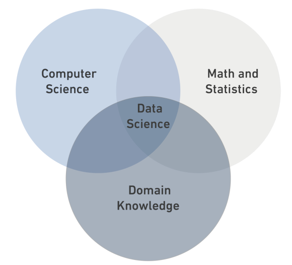

# Data Science

## What is Data Science?

**Data Science** is a _multidisciplinary field_ that combin statistics , computer scince and domain nowledge.

### Data Types

- **Structured Data**
- **Unstructured Data**
- **Semi-structured Data**

#### Data Types Table

| Structured                                                | semi-structured                                                     | Unstructured                  |
|-----------------------------------------------------------|---------------------------------------------------------------------|-------------------------------|
| It is data that has been organized into a strict schema.  | It is data that does not conform to a schema but has some structure.| It is data that has no schema.|
|                                                           |                                                                     |                               |
| e.g: Tables                                               |e.g: xml                                                             |                               |

``python
print("DS Bootcamp")``

Read more: [Read more](https://en.wikipedia.org/wiki/Data_science).

